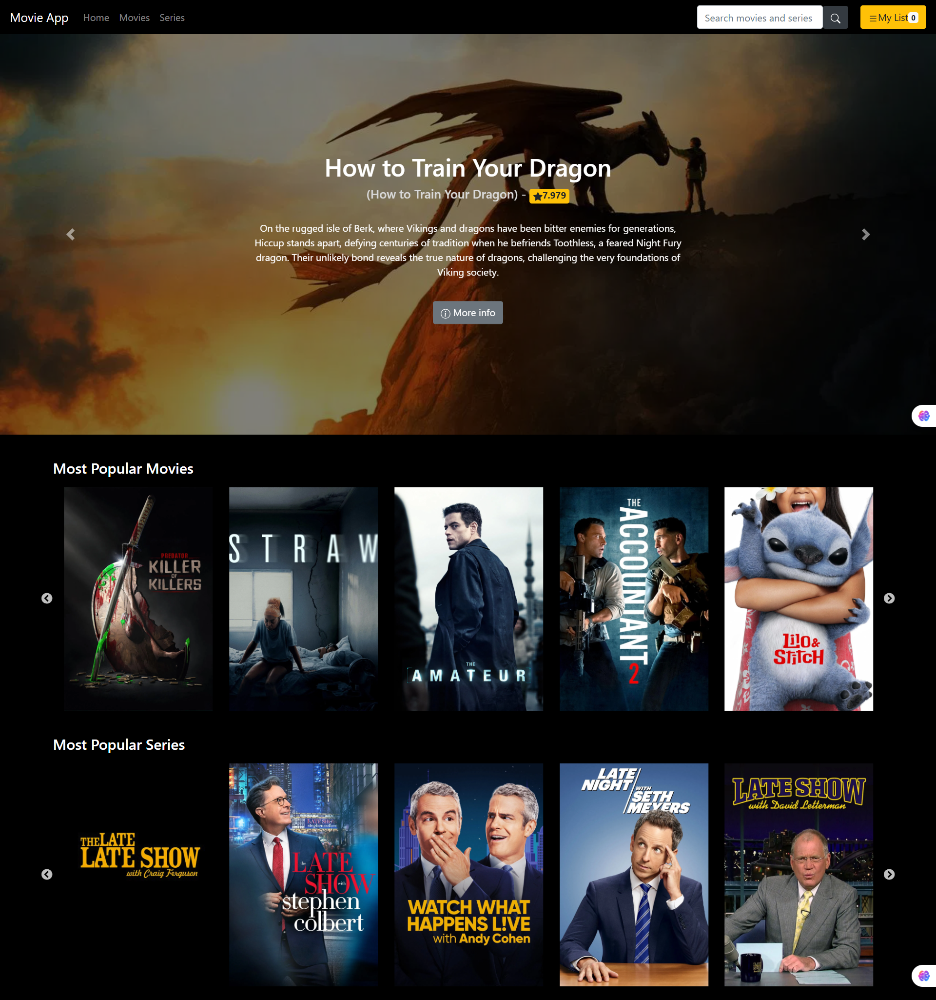

# 🎬 Movie App

A modern, responsive Movie and TV Series web application built with **React**, powered by the [TMDB API](https://www.themoviedb.org/documentation/api), and enhanced with Firebase features like a personalized **My List**.

 

 <!-- Make sure the image is named preview.png or update the path -->

---

## 📌 Features

- 🔍 Search for trending movies and TV series
- 📺 Browse popular **Movies** and **Series**
- 🧾 View detailed info: titles, posters, rating, overview
- ⭐ Add movies/series to **My List** (Firebase)
- 🎞️ Full-screen carousel for trending content
- 📱 Responsive layout using **React-Bootstrap**
- 🌐 Default language: **English**

---

## 📁 Project Structure

src/
├── Components/ # UI blocks (Carousel, Posters, Menu)
├── Pages/ # Page-level routes (Home, Movies, Series)
├── Context/ # React Context API for My List
├── Config/ # Firebase config
├── Styles/ # Custom CSS
├── App.js # Main component
└── index.js # Entry point

---

## 🛠 Tech Stack

- **Frontend:** React, React Router, Bootstrap
- **Data Source:** TMDB API
- **State Management:** React Hooks, Context
- **Firebase:** Firestore (My List), Auth (optional)

---

## 🔑 Setup Instructions

### 1. Clone the Repository

git clone https://github.com/your-username/movie-app.git
cd movie-app

### 2. Install Dependencies

npm install

### 3. Add TMDB API Key

Replace the default TMDB API key in these files:

Carousel.js
PopularMovies.js
PopularSeries.js
SearchBox.js
MovieDetails.js
SerieDetails.js

### 4. Firebase Setup (Optional but Recommended)

Create a Firebase project: https://firebase.google.com

Enable Firestore
Copy the config snippet and paste it into:

src/Config/firebase.js
Install Firebase SDK:

npm install firebase

### 5. Run the App 🚀

If using Node v16 or lower:
npm start
If using Node v17 or higher:

# For Windows PowerShell

$env:NODE_OPTIONS="--openssl-legacy-provider"

Then run:
npm star

### Preview

🧑‍💻 Author
Developed by Irteja Mahmud
